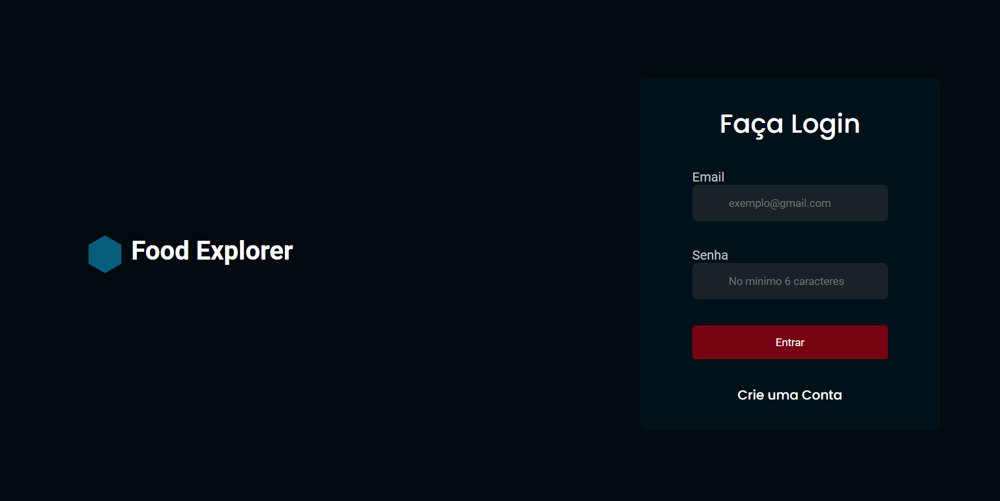
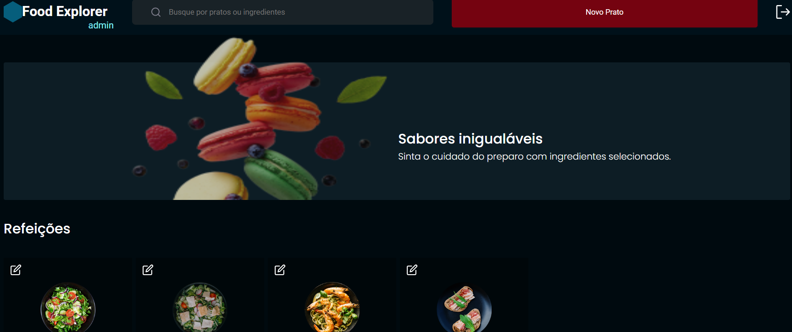
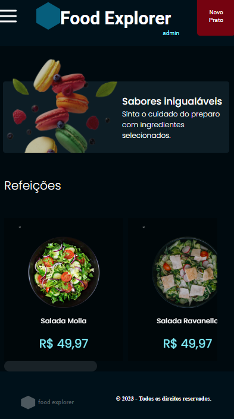
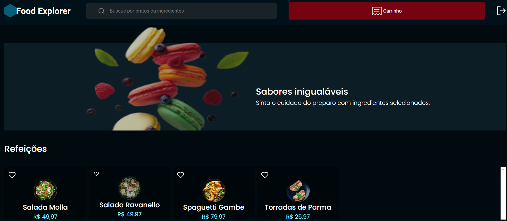
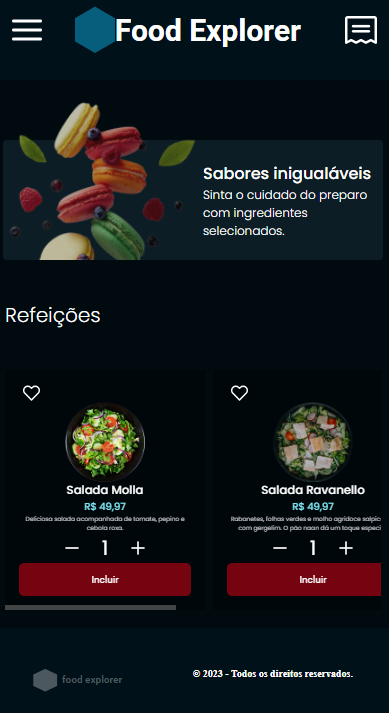

## Autor

- Api criado por Luigi Oliveira para o desafio final do curso Explorer.

## Referência

 - [Rocketseat](https://app.rocketseat.com.br/journey/explorer/contents)
 - [Explorer](https://app.rocketseat.com.br/?type=ALL)
 - [Link do Deploy](https://celebrated-genie-8221af.netlify.app)
## Food Explorer WEB:

- Aplicação responsiva utilizando o styled-components com REACT.
- Tem integração com o back-end próprio para o consumo da aplicação, seguindo os princípios da API RESTFUL.
- A aplicação tem uma separação de rotas, para o login e, se o usuário e admin ou customer. Customer para consumir a aplicação e, admin para cadastrar os pratos presentes na aplicação.

